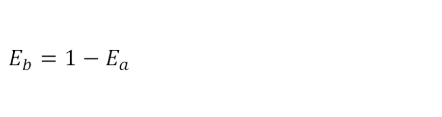

# 🔗 Elo Rating Algorithm

## ⏳ Elo Rating Algorithm History

The Elo Rating algorithm, created by Arpad Elo _(a Hungarian-Amerian Physics Professor)_, is one of the most common algoritms used for rating because of the logic & functionality behind it.

It is used by developers that want to rank chess players to college students wanting to rank girls _(Mark Zucherberg's Face Smash)._

**_But how does it work? How can I implement it into my code?_**

---

## 🔧 Demystifying The Algorithm

The algorith is **based on two key formulas**.

1. The first formula tells you how to predict the outcome of the game.
2. The second formula tells you how to update your rating depending on the outcome of the game.

**This is how they look:**

_Formula A:_

<!-- $\huge E_a=\frac{1}{1+10(^{R_b-R_a})^{/400}}$ -->

_Formula B:_

<!--$\huge E_b=1-E_a$-->

**Don't get disencouraged by how the formulas look!** We'll go through this step by step.

---

## 🧠 Understanding the Algorithm

When Arpad Elo first invented the algorithm, his idea was to asume that **each players ability forms a bell curve.**

Image that each player brings a box with them to every game. Before every game, they pull out a number from that box. **Whoever has the highest number wins.**

That number represent a players ability to win the match.

This means that every player has the potencial of playing at a range of different abilities.

> _Somedays, a player might be feel great and pick a high number._

> _Other days, that player might feel sick or unlucky and pick a low number._

> _Most of the time, however, that player picks a number in the middle of their range._

**An elite player will generally be picking from a box of very high numbers. _So they are more likely to win but not always..._**

If you pay attention at the frequency of the numbers, you'll realize that they form bell curves.

_Notice how the bell curves are **exactly the same.** The only difference is the center of the curves._

**The center of the curves represents the mean or averge and the averege is that players rating.**

---

## 🏀 Formula 1 (Probability of Winning The Game)

To do this, we need to find the _**frequency of the differences between the two players.**_

If you plot that, you also get a bell curve. **It's called a logistic curve.**

**The idea is that the more of the curve is to the right of 0, the more likely that player is to win.**

_Basically, the Elo Rating Algorithm is designed so that if a player has a rating that is 400 points more than another player, they are 10 times more likely to win._

So in the curve, the area to the right of 0 would be 10 times the area of the curve to the left of 0.

**_If you turn that into a formula, this is the formula that you would get:_**

So, If Player A has a rating of _Ra_, and Player B has a rating of _Rb_, the exact formula for the expected score of Player A is:

You can simmilarly look at the probability for Player B to win by:

With this, you can predict who will win the game.

**EXAMPLE:** _If the probability of winning is 1, your going to win the game. If the probability of winning is 0, your going to win the game._

**IMPORTANT:** probability of winning is 0.5 (half), then your going to win as many games as you loose. Basically a draw.

Now, lets say that:

| Win | Loose | Draw |
| --- | ----- | ---- |
| 1   | 0     | 0.5  |

**Then, the probability can be used as the expected score.**

> It can be wierd like if you have a probability of **0.75**.

> _This means that you could win 75% of the games and loose the other 25%._

> _But it also means that you coud win 50% of the games and draw the other 50% of the games._

> **Either way, we would say the expected score is 0.75**

**Whenever a player does better than expected, their rating will increse. The more surprising that the win is, the more points they will get. Up to a max of 32 points.**

_Nothing special about 32, just a choice that they made._

**The same way, if a player does worse than expected, their rating will decrease up to 32 poibts.**

---

## 🛥 Formula 2 (The Update Formula)

Throughout a tournament, a players raiting **is updated using an update formula.**
